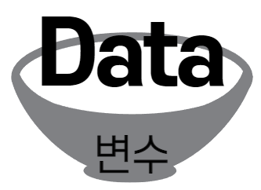
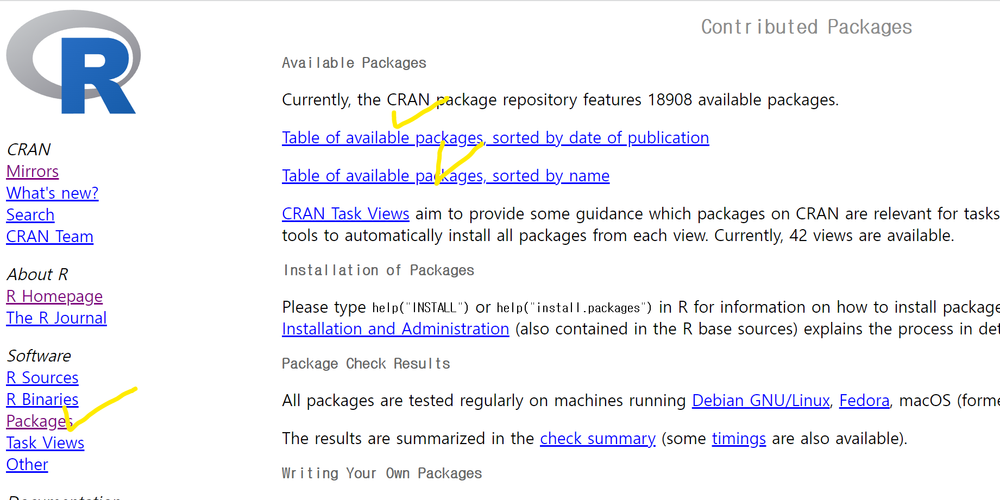
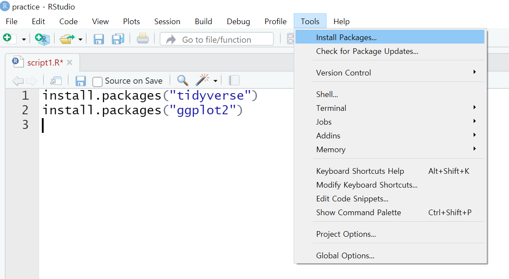
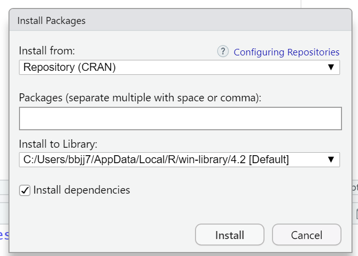
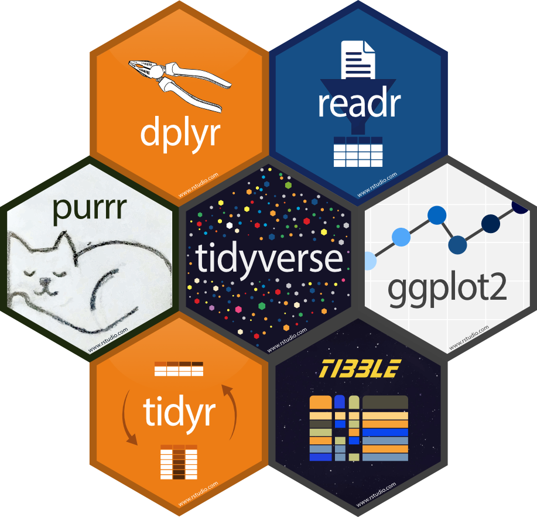

# Basic programming in R

## R 문법의 기초 ***Communicating in R language***

R은 기본적으로 함수형 언어입니다. 함수는 `함수명()`의 형태로 되어 있고, `( )`안에는 필요한 인자들을 입력할 수 있습니다. 인자(argument)란 특정 함수가 실행되는 조건들을 지정해주는 함수의 요소라고 생각하시면 됩니다. (e.g. `lm(Y~X, data)`)

한편, 어떤 인자들은 반드시 괄호 안에 입력해주어야 하는 반면, 어떤 인자는 입력하지 않아도 되는데, 이를 기본인자라고 합니다. 기본인자는 함수를 정의할 때 특정 조건이 미리 지정되어 있는 것이므로 특별히 다른 조건을 원하지 않는다면 생략해도 됩니다. (e.g. `q()` :R의 종료 명령어)

함수의 기능과 필요한 인자를 찾기 위해 R의 도움말을 참고하시면 됩니다. 알고자 하는 함수에 대한 도움말은 콘솔창에서 `help(함수명)` 또는 `?함수명` 을 입력하면 됩니다. (e.g. `help(lm)` 또는 `?lm`)

다음은 R에서 객체(object) 또는 변수를 만들고 사용하는 방법을 알려 드리겠습니다. R에서 객체란, 데이터가 담겨 있는 메모리의 주소 값, 즉 데이터를 담는 그릇입니다. R에게 분석해야 할 데이터를 줄 때 객체/변수라는 그릇에 담아서(=할당하여) 준다고 생각하시면 됩니다. (e.g.`객체/변수 이름 <- 저장할 값`)

할당한다는 것의 의미: 값을 객체에 저장한다는 것. 영어로는 assign (지정, 할당). 할당자로는 `<-`또는 `=` 을 사용함.

```{r, echo=FALSE, out.width='25%', fig.align='center', fig.cap='변수 <- 데이터'}

```

객체/변수의 이름을 정할 때의 주의사항:

-   이름은 한글, 영어, 숫자 등이 가능하지만 반드시 첫 글자는 문자여야 함
-   이름이 영어일 경우 소문자와 대문자는 다른 글자로 인식함

객체에 값을 할당하는(=변수에 값을 담는) 연습을 해봅시다.

```{r , results='hide', eval=FALSE}
        var1 <- 1 # var1 이라는 변수에 숫자 1 담기
        var1 # 출력하여 확인 
        var2 <- 2 # var2 라는 변수에 숫자 2 담기
        var2 # 출력하여 확인
        var3 <- "대학원생" # var3 변수에 글자 담기. 
        									# "" 주의
        var4 <- as.Date("2022-12-01") # 날짜 데이터 담기
        var5 <- "Hello world" # 문자열 데이터 담기
```

```{r , results='hide',eval=FALSE}
        # new line by ; (semicolon)
        Name <- "Kossda" ; Age <- 25; City <- "Seoul" 
        Name 
        Age
        City 
```

## 데이터 유형 ***Data type***

이제부터는 객체/변수에 담을 수 있는 데이터 유형을 알아보겠습니다.

### 숫자형 데이터(numeric)

```{r , results='hide',eval=FALSE}
        age <- 20 # age 라는 변수에 숫자 20 담기
        Age <- 50 # Age라는 변수에 숫자 50 담기
        					# R is case sensitive ; age and Age are different
```

### 문자형 데이터(character/string/text)

참고) 문자형 데이터를 다루는 데 특화된 패키지: `stringr`, `tidytext`

```{r , results='hide'}
      #데이터유형 확인
      class(5) 
      class("5")
      class("2022-12-01") #날짜 같지만 문자형
      class("Hello World!") #문자열도 문자형
                
      # assign to a variable 
      greeting <- "Hello World!" 
      greeting 
                
      x = "100" 
      class(x)      # character type: let's convert it to numeric type
      as.numeric(x) # converts to numeric type 
      class(x)      # you should assign it to x to update
      x = as.numeric(x)
      class(x) 
                
      x = "kossda" 
      as.numeric(x) # fails
```

### 날짜형 데이터 `as.Date()`

참고) 날짜형 데이터를 다루는 데 특화된 패키지: `lubridate`

```{r , results='hide'}
        date1 <- as.Date("2022-12-25")
        date2 <- as.Date("2022-12-01")
        date1 - date2  #날짜 연산 가능
        difftime(date1, date2)
```

### NA형과 NULL형

-   NA(Not Applicable)형: 학년 변수에 1, 2, 3, 4 등의 값들이 들어와야 하는데 "손흥민"같은 문자형 값이 들어온 경우.
-   NULL(Not Available)형: 데이터 값이 아예 없다는 말. 즉 비어 있음. NA와 달리 연산을 하면 NULL값을 자동으로 제외시키고 연산을 진행함.

```{r , results='hide'}
        no1 <- 3
        no2 <- NA
        no1 + no2 # 연산 결과를 NA로 만들어 버림
                
        sum(1, 2, NA)
        sum(1, 2, NULL) # NULL값을 자동으로 제외시키고 연산을 진행함
                
        x <- NA
        sum(1, 2, x)
        sum(1, 2, x, na.rm=TRUE) # NA값 제거
```

### 논리형 데이터(logical: True or False)

```{r , results='hide'}
        true <- T
        true
        class(true)
        
        false <- F
        false
        class(false)
        
        # 참고
        is.na(x)

```

## 변수 유형 ***Variable type***

데이터를 분석할 때는 변수의 유형 및 속성에 따라 분석기법이 달라집니다.

| 변수 유형          | 예시                            | 변수 속성            | R에서 분류           |
|:-----------------|:-----------------|:----------------|:-------------------|
| 명목형(nominal)    | 성별: 남성, 여성                | categorical          | factor (범주변수)    |
| 순서형(ordinal)    | 건강상태: poor, good, excellent | ordered/ categorical | factor (범주변수)    |
| 연속형(continuous) | 연령: 22, 34, 45                | numerical            | numerical (수량변수) |

```{r , results='hide'}
        diabetes <- c(1, 2, 1, 1)
        diabetes <- factor(diabetes) #범주변수로 처리
            
        #알파벳 순서로 1=excellent, 2=good, 3=poor로 정함
        status <- c("poor", "good", "excellent", "poor")
        status <- factor(status)  
            
        #순서를 1=poor, 2=good, 3=excellent로 정함
        status <- factor(status, levels=c("poor", "good", "excellent"))
        status <- factor(status, levels=c("poor", "good", "excellent"), order=TRUE)
```

## 데이터 구조 ***Data structure***

R에서 취급하는 데이터는 여러 구조를 가질 수 있습니다. 가장 단순한 형태부터, 실제로 분석에서 많이 쓰이는 형태까지 훑어 봅시다.

### 벡터(Vector)

-   숫자 또는 문자의 나열
-   하나의 벡터에는 반드시 데이터 유형이 같은 값들만 들어가야 함

```{r , results='hide'}
        v1 <- 1:5 
        v2 <- c(6:10) # c() : combine 
        v3 <- seq(from = 1, to = 10, by = 2)
        v4 <- rep(0, times = 10) 
            
        var1 <- c(1, 2, "3")
        class(var1)
            
        # Indexing을 이용한 벡터의 원소 접근 및 연산
        v5 <- NULL # empty object 
        v5[1] <- v1[1] + v1[3]; v5
        v5[1] <- v1[1] + v1[3]; v5
        v5[2] <- v1[1] / 0; v5
        v5[3] <- 0/0; v5
        v5 <- v5[-1]; v5 # omit the first element 
            
        # 문자열 벡터
        fruit <- c("banana", "apple", "pine", "tree")
        fruit
        grep('p', fruit)
        grep('p', fruit, value = T)
        paste(fruit[3], fruit[2], sep = "") 
        substr(fruit[1], 3, 6)
```

### 행렬(Matrix)

-   여러 개의 벡터로 구성된, 가로 X 세로 형태의 행렬
-   벡터와 마찬가지로 동일한 유형의 데이터가 들어가야 함

```{r , results='hide'}
        mat1 <- matrix(c(1, 3, 6, 9, 12, 15), nrow = 2, ncol = 3); mat1 
        mat2 <- matrix(c(1, 3, 6, 9, 12, 15), nrow = 2, ncol = 3, byrow = T); mat2 
        v6 <- as.vector(mat2); v6 # as.vector() : make the object into 'vector'
        mat3 <- matrix(v6, nrow = 3, ncol = 2); mat3
            
        # vector를 이용한 matrix 생성
        mat4 <- rbind(v1, v2, v3); mat4
        mat5 <- cbind(v1, v2, v3); mat5
        mat6 <- mat4 %*% mat5; mat6 # matrix multiplication 
        mat7 <- mat4 * mat4; mat7 # Kronecker product ( Different from %*% !! )
            
        # indexing / 차원 확인
        m <- matrix(1:9, 3, 3); m 
        m[, 1:2]
        m[c(1,3),]
        m[2:3, 2:3]
        dim(m)
        length(m)
        length(v1)
```

### 리스트(List)

-   서로 다른 데이터 유형들을 묶어서 하나의 리스트로 저장 가능
-   주로 텍스트 분석에서 많이 사용
-   리스트 = 큰 방
  -   변수 = 작은 방
    -   값

```{r , results='hide'}
        list1 = list(c(1,5,3), matrix(1:6, nrow=3), c('hello', 'world'))
        list1
        list1[[1]] ; mode(list1[[1]])
        list1[1] ; mode(list1[1])
        list1[[2]][2,1]
        # list1[2][2,1] # Error ! 
        list1[[2]][2] <- 'world' ; list1[[2]]
        list1[c(1,3)]
```

### 데이터 프레임(Data Frame)

-   다양한 유형의 데이터들을 저장. 가장 많이 사용하는 형태
-   엑셀 표라고 생각하면 됨

| NO  | NAME     | BIRTH      |
|:----|:---------|:-----------|
| 7   | 손흥민   | 1992-07-08 |
| 10  | 해리케인 | 1993-07-28 |
| 9   | 홀란드   | 2000-07-21 |

```{r , results='hide'}
        no <- c(7, 10, 9)
        name <- c("손흥민", "해리케인", "홀란드")
        birth <- c("1992-07-08", "1993-07-28", "2000-07-21")
        player <- data.frame(NO=no, NAME=name, BIRTH=birth)
        player 
        
        # or 
        m
        data <- data.frame(m); data # Difference btw 'matrix' and 'dataframe' ? 
        colnames(data)
        rownames(data) <- c("N1", "N2", "N3")
        data
        data <- data.frame(data, "class" = c(1, 1, 3))
        data
        data[, 4] # data[row index, column index]
        data$class # data$variable
```

## R 패키지와 라이브러리 ***R packages and libraries***

-   패키지는 다양한 함수, 명령어, 데이터들의 집합. 원하는 분석에 적합한 패키지를 찾아서 사용하는 것이 중요함. 구글링 필수!
-   R에서 기본으로 제공하는 베이스 함수나 데이터 등 외에 특정 분석이 가능하도록 여러 사람이 만들어 제공하는 함수들의 묶음인 패키지들이 존재함.
-   CRAN(<http://cran.r-project.org>)에서 모든 패키지를 직접 검색하고 다운로드할 수 있음. 아래 사진에의 왼쪽의 [Packages]를 클릭하면 패키지가 만들어진 날짜 기준으로 혹은 이름 기준으로 패키지 목록을 확인이 가능하며 다운로드 역시 가능함.

```{r echo=FALSE, out.width = "60%", fig.align = "center"}

```

### 패키지 설치 방법

패키지는 반드시 인터넷 환경이 조성되어야 설치 가능함. 패키지는 라이브러리\>문서\>R폴더에 저장됨. 경로를 확인하고 싶으면 .libPaths() 명령어 입력.

1)  명령어 직접 입력

```{r , results='hide'}
        #install.packages("tidyverse")
        #install.packages("ggplot2")
        
        # or
        #install.packages(c("tidyverse", "ggplot2"))
```

2)  메뉴 이용

-   상단 [Tools] \> [Install Packages] 클릭한 후 나타나는 창에 패키지 이름을 입력한 후 다운

```{r echo=FALSE, out.width = "60%", fig.align = "center"}

```

```{r echo=FALSE, out.width = "60%", fig.align = "center"}

```

3)  CRAN(<http://cran.r-project.org>) 이용

### 패키지 사용하기

패키지를 설치한 후에 그 패키지를 이용해서 분석을 하기 위해서는 설치한 패키지를 불러와야 함.

1)  패키지 불러오기: 반드시 library("패키지명") 함수로 불러들임. R을 사용하다가 종료하고 다시 시작했을 경우에도 다시 library("패키지명")을 실행하여야 패키지 안에 여러 함수나 데이터들을 쓸 수 있음.

```{r , results='hide'}
        #install.packages("tidyverse")
        #install.packages("ggplot2")
        #library("tidyverse")
        #library("tidyverse")
            
        # update.packages("패키지명") # 설치되어 있는 해당 패키지 업데이트
        # installed.packages()        # 어떤 패키지들이 설치되어 있는지 확인
        # remove.packages("패키지명”) # 해당 패키지 삭제
```

2)  자주 쓰이는 패키지 **tidyverse**

```{r echo=FALSE, out.width = "50%", fig.align = "center"}

```
