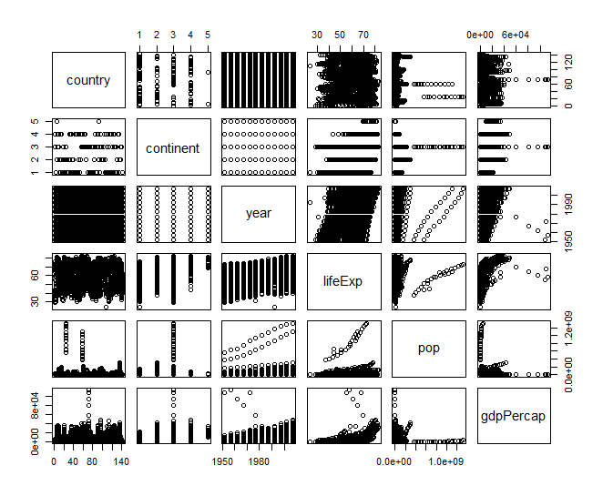
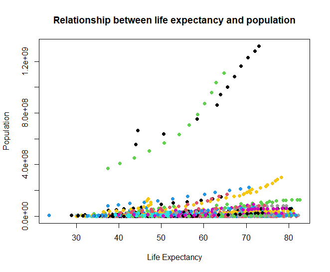
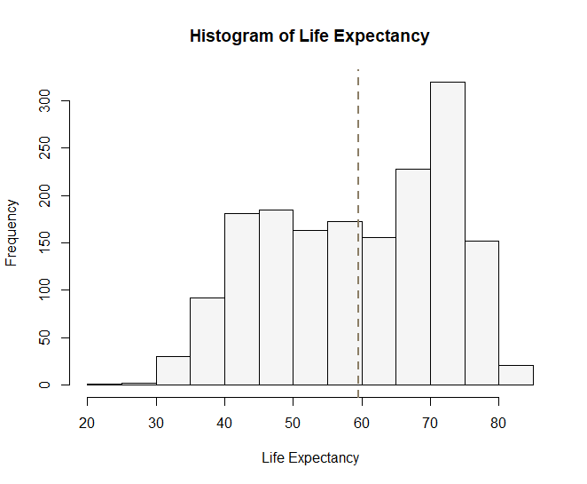
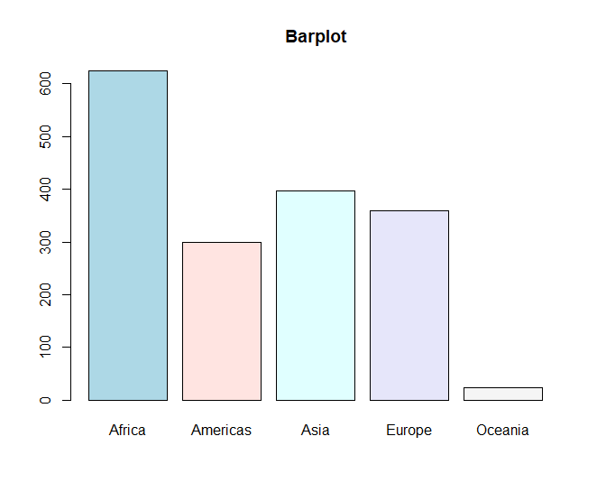
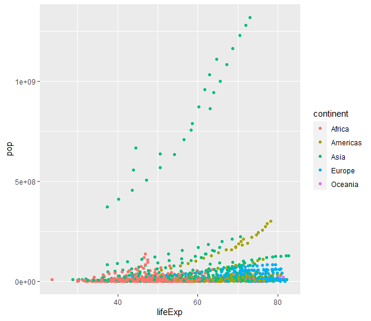
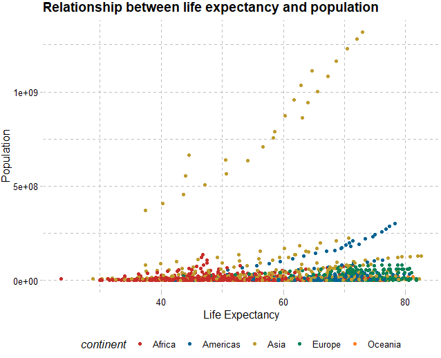
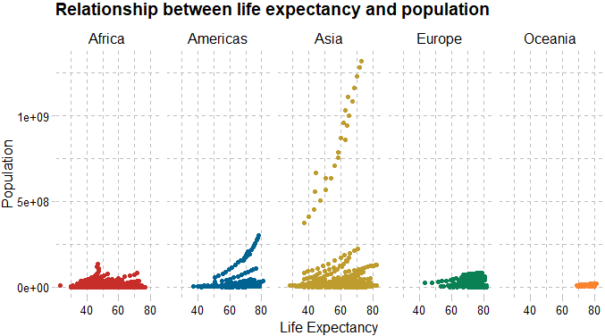
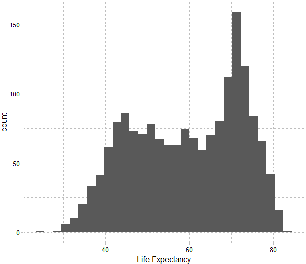
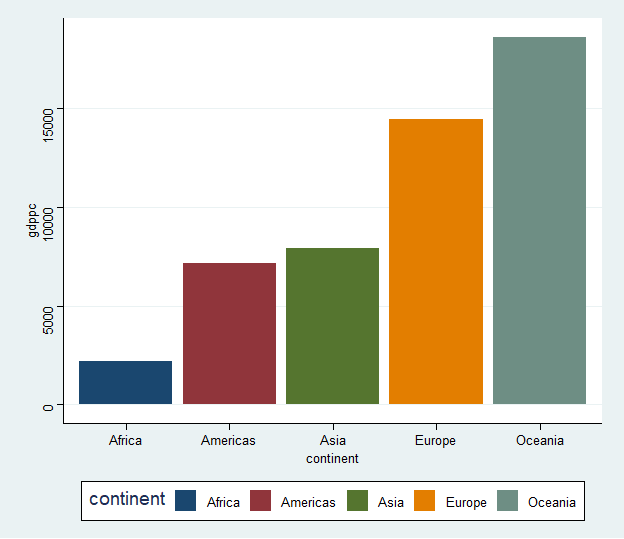
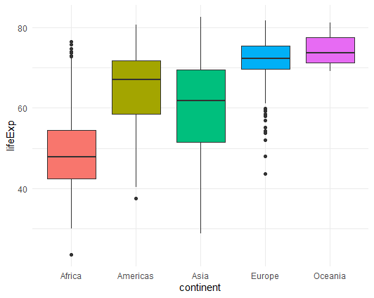

# Visualizastion in R

먼저 R에서 기본으로 제공하는 base 함수들로 시각화 연습을 해본 후, tidyverse의 ggplot2() 를 통해 시각화하는 연습을 해보겠습니다.

## ***R base plot***

Base 함수들 중 자주 쓰는 것들은 다음과 같습니다: plot(), hist(), barplot(), boxplot(). 이 함수들을 사용하여 gapminder 데이터를 다양하게 시각화해 봅시다.

```{r , results='hide', eval=FALSE}
# plot() : 변수들 간 관계를 한 눈에 볼 수 있는 이변량 그래프 그리기 (산점도;                       scatterplot) 
plot(gapminder)
```

```{r echo=FALSE, out.width = "80%", fig.align = "center"}

```

예) 기대수명이 증가할수록 인구는 어떻게 변화할까요? x축은 lifeExp, y축은 pop의 값들을 산점도로 그려 표현한 것이 바로 5행 4열에 있는 그래프입니다. 패턴을 보니 lifeExp 변수와 pop 변수 간 양의 상관관계가 있습니다. 즉 기대수명이 높아질수록 인구는 증가하는 추세를 보입니다.

이 두 변수 간 그래프를 확대해 볼까요? `plot(x축, y축)`

```{r , results='hide', eval=FALSE}
plot(gapminder$lifeExp, gapminder$pop) 

# options 추가 
plot(gapminder$lifeExp, gapminder$pop, col=gapminder$country, pch=19, 
     xlab="Life Expectancy", ylab="Population", 
		 main="Relationship between life expectancy and population")
```

```{r echo=FALSE, out.width = "80%", fig.align = "center"}

```

연속형 변수의 빈도 분포를 살펴보는 데에는 hist() 함수를 사용합니다. 기대수명 변수의 히스토그램을 그려봅시다.

```{r , results='hide', eval=FALSE}
hist(gapminder$lifeExp)

# customize 
colors() # check available colors in R 
hist(gapminder$lifeExp, col="whitesmoke", 
		 xlab="Life Expectancy", main="Histogram of Life Expectancy")
abline(v=mean(gapminder$lifeExp), col="wheat4", lty=2, lwd=2) # add line
```

```{r echo=FALSE, out.width = "80%", fig.align = "center"}

```

다음은 범주형 변수의 분포를 살펴보기에 좋은 barplot() 입니다. 각 대륙에 해당하는 값들이 몇 번 등장하는지를 시각화해봅시다.

```{r , results='hide', eval=FALSE}
table(gapminder$continent) # 빈도표 

# 빈도표 자체를 input으로 넣어서 barplot 그리기
barplot(table(gapminder$continent)) 

barplot(table(gapminder$continent), 
        col = c("lightblue", "mistyrose",
                "lightcyan", "lavender", "whitesmoke"),
        main = "Barplot")
```

```{r echo=FALSE, out.width = "80%", fig.align = "center"}

```

마지막으로 범주형 변수 별로 연속형 변수의 분포를 살펴보기에 좋은 boxplot() 입니다. 각 대륙 별로 기대수명의 분포를 시각화해봅시다.

```{r , results='hide', eval=FALSE}
boxplot(lifeExp ~ continent , data = gapminder) 

boxplot(lifeExp ~ continent , data = gapminder,
        col = c("lightblue", "mistyrose",
                "lightcyan", "lavender", "whitesmoke"),
        main = 'Boxplot',
        xlab = "Continent", 
        ylab = "Life Expectancy")
```

```{r echo=FALSE, out.width = "80%", fig.align = "center"}
knitr::include_graphics("images/4-5.png")
```

## ***Tidyverse - ggplot2***

다음은**`tidyverse`**의 `ggplot2` 를 통한 시각화를 연습해 보겠습니다. `ggplot2`의 "*GG"는 Gramar of Graphics* 를 의미합니다. `%>%` (파이프 연산자)를 통해 층을 겹겹이 쌓아올려 효율적인 시각화가 가능하며, 여러가지 테마를 적용하여 customize할 수 있다는 점이 장점입니다 (반대로 말하면, 자유도가 높다는 게 처음 배울 때 진입장벽으로 작용할 수 있습니다). 하나씩 천천히 해봅시다!

기본적인 문법 구조는 다음과 같습니다:

```{r , results='hide', eval=FALSE}
#데이터 
       %>% 
		ggplot(aes(x=x축에 올 변수 이름, y=y축에 올 변수 이름)) + # aesthetic - coordination space 그리기 
		geom_point() + # geometry - geom_으로 시작하는 함수 입력 
		theme() # theme 적용 - 꾸미기
```

ggplot() 함수를 통해 축을 설정하고 좌표 공간을 먼저 만들어 주신 후에는 파이프 연산자가 아닌 +로 연결을 해주세요.

```{r , results='hide', eval=FALSE}
# scatterplot
# basic form: 
gapminder %>% 
  ggplot(aes(x=lifeExp, y=pop)) + 
  geom_point()

# color by continent: 
gapminder %>% 
  ggplot(aes(x=lifeExp, y=pop, col=continent)) + 
  geom_point()
```

```{r echo=FALSE, out.width = "80%", fig.align = "center"}

```

```{r , results='hide', eval=FALSE}
# theme: 
# 아래의 패키지를 설치해 주시고, 불러와 주세요:
install.packages("ggthemes")
install.packages("ggpubr")
library(ggthemes)
library(ggpubr) 

gapminder %>% 
  ggplot(aes(x=lifeExp, y=pop, col=continent)) + 
  geom_point() +
  theme_pander() + # 테마 설정 
	xlab("Life Expectancy") + # x축 라벨
	ylab("Population")  # y축 라벨

gapminder %>% 
  ggplot(aes(x=lifeExp, y=pop, col=continent)) + 
  geom_point() +
  theme_pander() + 
  xlab("Life Expectancy") +
  ylab("Population") +
  ggtitle("Relationship between life expectancy and population") + # 그래프 제목 
  theme(legend.position = "bottom") + # 범례 위치 
  scale_color_wsj() # 색상 테마 적용 
```

```{r echo=FALSE, out.width = "80%", fig.align = "center"}

```

대륙별로 따로 그리고 싶다면: facet_grid() 함수를 추가. (자매품: facet_wrap() 도 있음)

```{r , results='hide', eval=FALSE}
gapminder %>% 
  ggplot(aes(x=lifeExp, y=pop, col=continent)) + 
  geom_point() +
  theme_pander() + 
  xlab("Life Expectancy") +
  ylab("Population") +
  ggtitle("Relationship between life expectancy and population") + 
  theme(legend.position = "none") +  # 범례 삭제 
  scale_color_wsj() +
  facet_grid(~continent) # 대륙 별로 따로 grid를 설정 
```

```{r echo=FALSE, out.width = "80%", fig.align = "center"}

```

다음은 기대수명 변수의 히스토그램을 그려봅시다.

```{r , results='hide', eval=FALSE}
gapminder %>% 
  ggplot(aes(x=lifeExp)) + 
  geom_histogram() +
  theme_pander()
  xlab("Life Expectancy")
```

```{r echo=FALSE, out.width = "80%", fig.align = "center"}

```

바 그래프를 그려 봅시다. 대륙 별로 gdpPercap 변수의 평균을 계산하여 gdppc 변수를 새로 만들어 주신 후, x축에는 대륙, y축에는 gdppc 평균 값이 오도록 축을 설정해 주세요. 이번에는 Stata 테마를 적용해 보겠습니다.

```{r , results='hide', eval=FALSE}
gapminder %>%
  group_by(continent) %>% # continent 별로 
  summarise( 
    gdppc = mean(gdpPercap) # gdpPercap 변수의 평균 값을 취해 gdppc 변수에 넣어라 
  ) %>%  # 이 데이터를 기반으로 ggplot을 그리자 
  ggplot(aes(x=continent, y=gdppc, fill=continent)) + # 좌표 설정 
  geom_col() + # 바 그래프 그려 넣을 것임을 알려주고, 
  theme_stata() + # 테마 설정 
  scale_fill_stata() # 대륙 별로 색상을 채워 넣을 때 색상 테마 또한 설정
```

```{r echo=FALSE, out.width = "80%", fig.align = "center"}

```

마지막으로 각 대륙 별로 기대수명의 분포를 박스플롯으로 시각화해봅시다. 테마는 미니멀 테마로 설정하고, 범례는 제거해 줍시다.

```{r , results='hide', eval=FALSE}
gapminder %>%
  ggplot(aes(x=continent, y=lifeExp, fill=continent)) + 
  geom_boxplot() +
  theme_minimal() +
  theme(legend.position = "none"))
```

```{r echo=FALSE, out.width = "80%", fig.align = "center"}

```
