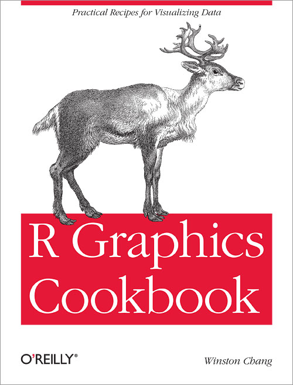

# Further Tips

다음은 R을 익힐 때 유용한 소스들입니다.

[{width="30%" height="20%"}](https://r4ds.had.co.nz/index.html) [{width="30%" height="30%"}](https://r-graphics.org/) [{width="30%" height="20%"}](https://ggplot2-book.org/index.html)
